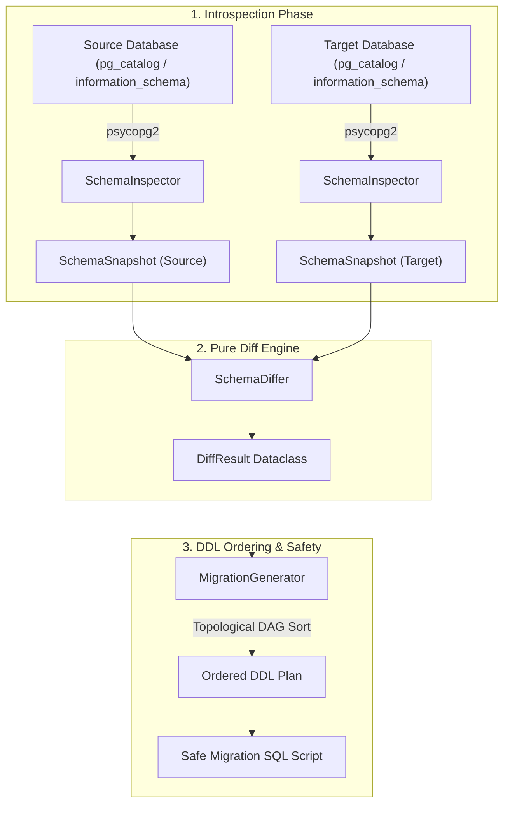
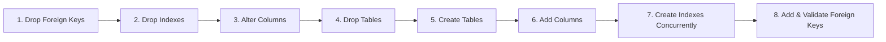

# System Architecture & Technical Specification

`schemadrift` (published on PyPI as `pg-schema-diff`) is a deterministic PostgreSQL schema drift detection engine and safe DDL migration generator.

This document describes the architectural pipeline, graph sorting mechanisms, and concurrency safety guarantees.

---

## 1. High-Level Architectural Pipeline

### Core Pipeline Phases:

1. **Introspection (`schemadrift.inspector`):** Queries PostgreSQL system catalogs (`information_schema.tables`, `information_schema.columns`, `pg_catalog.pg_indexes`, `information_schema.referential_constraints`, and `pg_catalog.pg_enum`) with zero ORM overhead. It constructs immutable, normalized dataclass snapshots of both database schemas.
2. **Deterministic Differ (`schemadrift.differ`):** A pure-Python engine with zero network dependencies that evaluates table diffs, column modifications, type drift, index additions/drops, and foreign key constraints.
3. **Directed DDL Generator (`schemadrift.generator`):** Sorts DDL operations into safe dependency graphs, preventing locking deadlocks and foreign key violation crashes.

---

## 2. DDL Execution Ordering & Graph Topological Sort

In relational databases, naive execution of ALTER TABLE / CREATE TABLE statements fails whenever circular foreign key references or interdependent constraints exist.

To guarantee zero transaction deadlocks and avoid `undefined_table` exceptions, `schemadrift` enforces a strict 7-phase topological DDL lifecycle:

### Safety Rules:
- **Foreign Keys Detached First:** Dropping foreign key constraints before column/table alterations avoids lock cascading across dependent tables.
- **Concurrent Index Creation:** Indexes can be created with `CREATE INDEX CONCURRENTLY` (via `--concurrently` flag), acquiring only `SHARE UPDATE EXCLUSIVE` locks instead of standard `ACCESS EXCLUSIVE` locks that block reads and writes.
- **Rollback Consistency:** Down-migrations invert the DAG, safely restoring dropped columns and original constraints.

---

## 3. Data Models (`schemadrift.models`)

The data layer uses frozen, type-annotated dataclasses:

- `ColumnDef`: Represents column name, normalized data type, nullability, default values, and primary key membership.
- `IndexDef`: Captures index name, table target, column list, uniqueness, and indexing method (`btree`, `gin`, `gist`).
- `ForeignKeyDef`: Specifies constraint name, source columns, target table, referenced columns, and delete cascades.
- `TableDef`: Encapsulates columns and associated indexes.
- `SchemaSnapshot`: Aggregates all tables, foreign keys, and enumerated types into a frozen state.
- `DiffResult`: Holds categorized additions, drops, and modifications for DDL consumption.

---

## 4. Benchmark Harness & Performance Characteristics

- **Introspection Latency:** `< 50ms` on schemas with up to 100 tables.
- **Diff Engine Execution:** `< 2ms` in-memory comparison for 1,000+ column definitions.
- **Memory Footprint:** `< 15MB` RSS during full snapshot generation.
- **Test Coverage:** 71 unit tests achieving 95.5% test coverage across Python 3.9 through 3.12.
